# OSインストール

------

作成日：2022-04-02

作成者：石田　和希

------

[TOC]

------


### 1.OSイメージの取得

​	・以下のURLからOSイメージをインストールする

```
https://jp.ubuntu.com/download/thank-you?version=20.04.4&architecture=amd64&platform=live-server
```

​	・2020年4月23日にリリースされたUbuntu 20.04 LTS (Focal Fossa)をインストールする

​	・2025年でサポート期限を迎えるが、ESMを購入することで2030年までサポートを受けることができる


### 2.OSのインストール


​	2.1.マシン起動後、以下の画面が表示されるので「English」を選択する

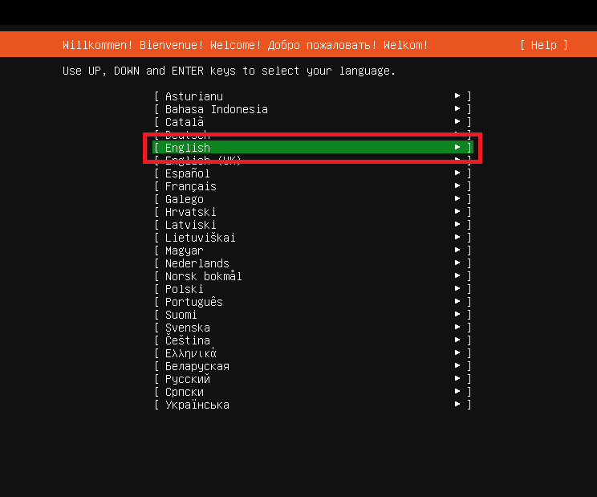


​	2.2.以下のように選択し、「Done」を選択

```
Layout：Japanese
Variant：Japanese
```

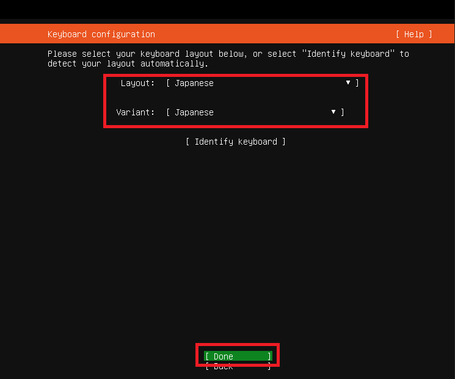


​	2.3.「ens160(NIC名)」を選択し「Edit IPv4」を選択する

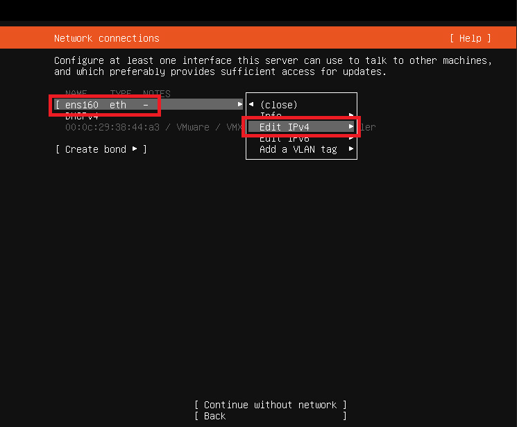


​	2.4.「Manual」を選択する

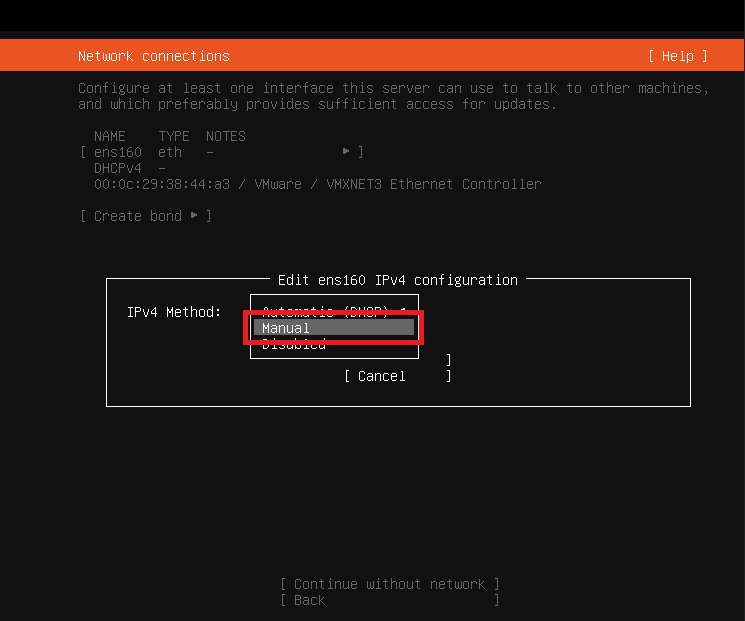


​	2.5.設定したいIPアドレスを入力し「Save」をクリックする

```
IPv4 Method：Manual
Subnet：10.90.210.0/24
Address：10.90.210.38
Gateway：10.90.210.254
Name servers：8.8.8.8
Search domains：空
```

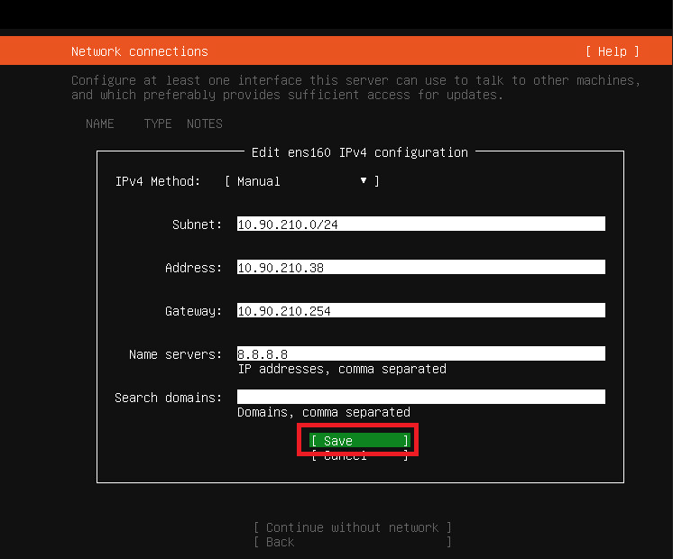


​	2.6.「Done」を選択する

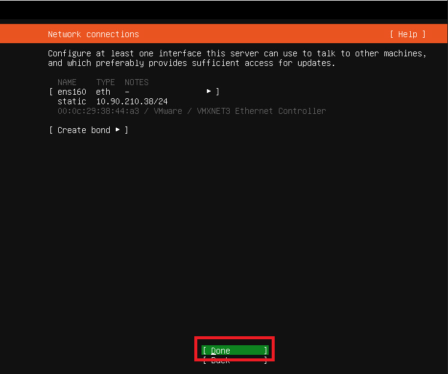


​	2.7.proxyサーバは不要なので、そのままの設定で「Done」を選択する

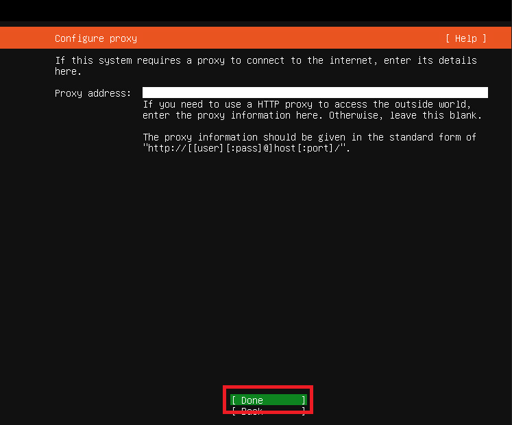


​	2.8.パッケージインストール時のミラーサーバが自動で選択されているので、そのままの設定で「Done」を選択する

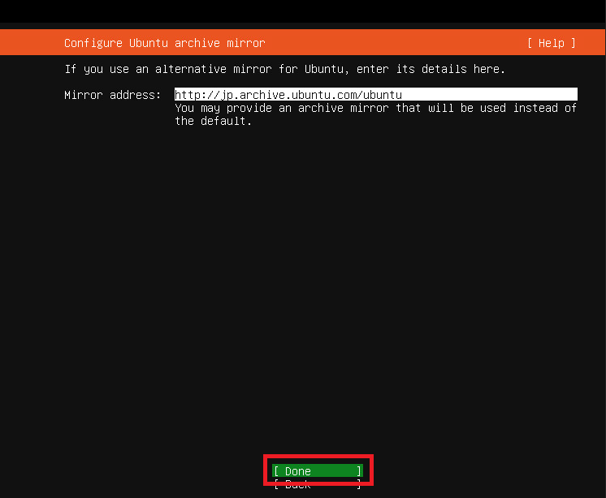


​	2.9.自分でパーティションを設定するため、「Custom storage layout」を選択し「Done」を選択する

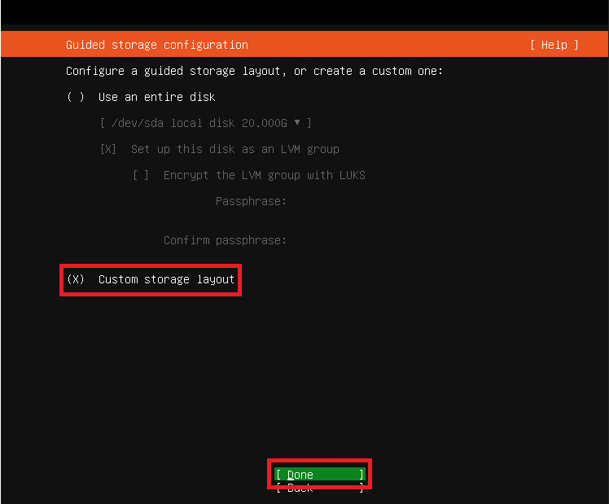


​	2.10.「free space」を選択し「Add GPT Partition」を選択する

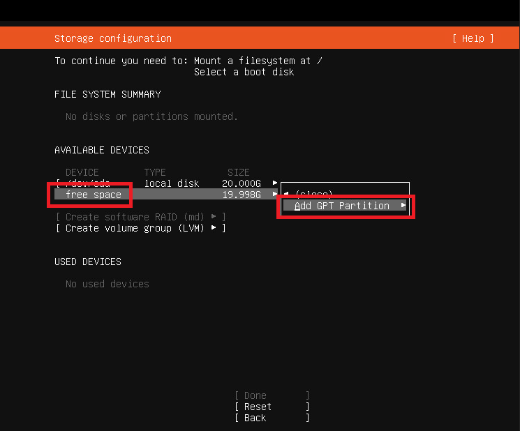


​	2.11.boot領域を設定し「Create」を選択する

```
Size：512M
Format：ext4
Mount：/boot
```

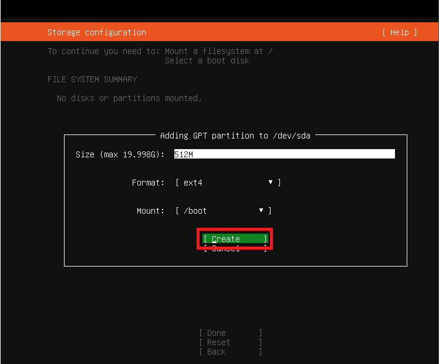


​	2.12.再度、「free space」を選択し「Add GPT Partition」を選択する

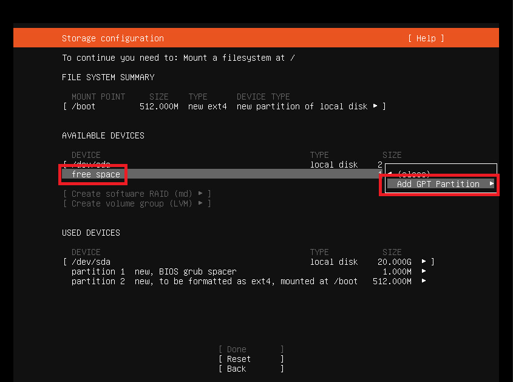


​	2.13./領域を設定し「Create」を選択する

```
Size：999999999999999(画面では19.497Gとなっているが、左記のように入力することで残り容量全てを設定できる)
Format：ext4
Mount：/
```

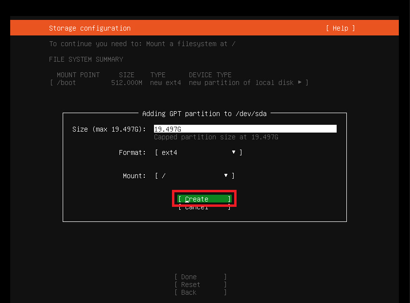


​	2.14.「Done」を選択する（ubuntuではswap領域は設定する必要がない（自動で設定される））


​	2.15.ディスク内の既存のデータを上書きしていいか警告が出るので「Continue」を選択する

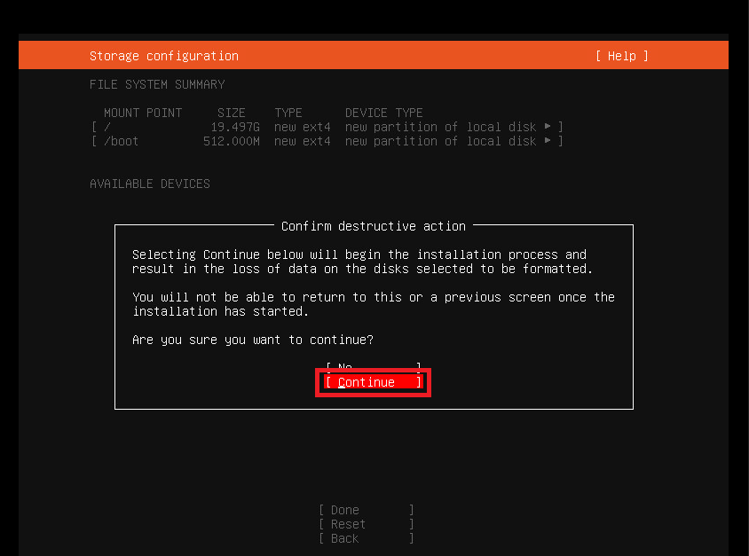


​	2.16.ユーザ情報を入力し「Done」を選択する

```
Your name：hisashi
Your server's name：hisashisv
Pick a username：hisashi
Choose a password：<パスワードを入力>
Confirm your password：<パスワードを入力>
```

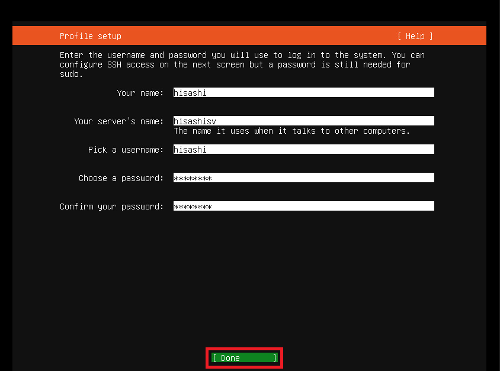


​	2.17.この時点ではESMは購入していないので、そのままの設定で「Done」を選択する

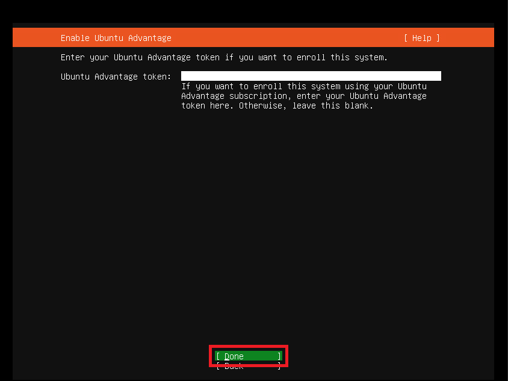


​	2.18.SSHのセットアップはあとで行うのでチェックを外し「Done」を選択する

```
[ ] Install OpenSSH server
```

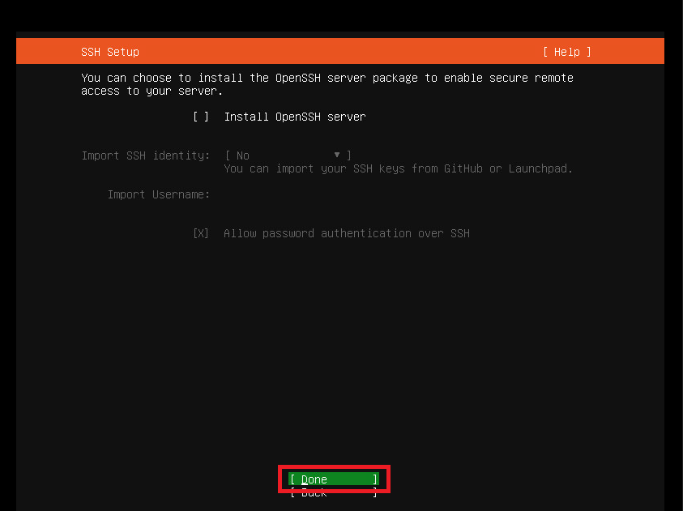


​	2.19.他パッケージはあとでインストールするので、そのままの設定で「Done」を選択する

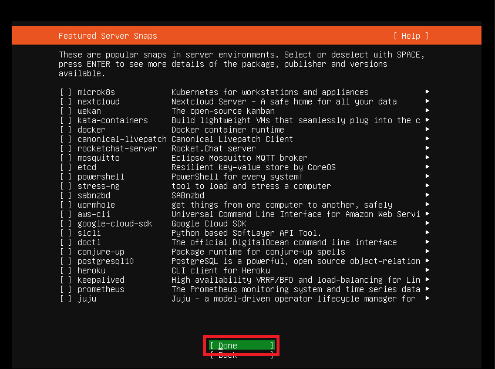


​	2.20.インストールが完了するのを待つ

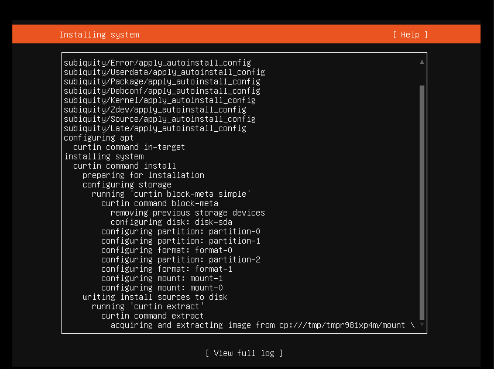


​	2.21.インストールが完了するので「Reboot Now」を選択する

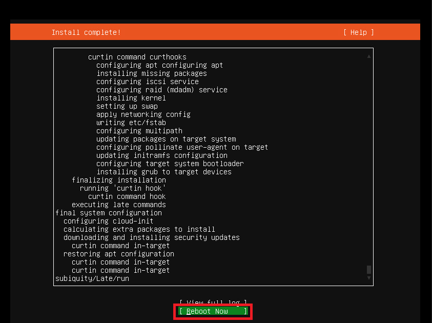


​	2.22.OSが起動することを確認する